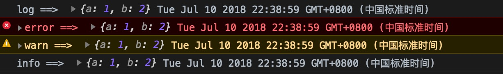
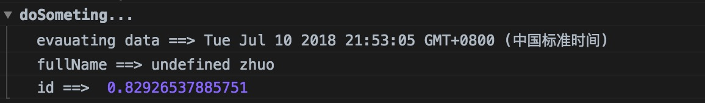
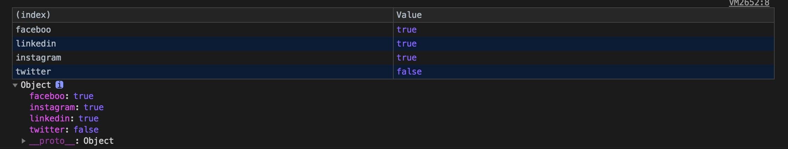
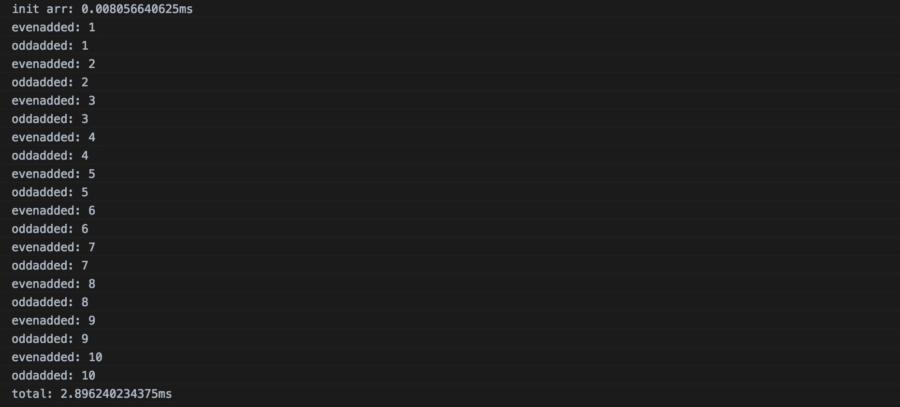
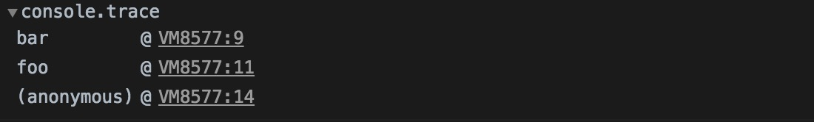

## ```console``` 常用的方法

是否有前端小伙伴和我一样，一直都 console.log() 打印信息（🙋...），最近看到篇国外文章写到几种常用 console 的方法，超实用，希望大家看完后能够提高开发效率。

> [ 文章都会保存在 github 上](https://github.com/hankzhuo/Blog/blob/master/Effciency/console.md)

> [JS 源码](https://github.com/hankzhuo/Blog/blob/master/Effciency/assets/js/console.js)

## 1、 ```congsole.log()、console.error()、console.warn()、console.info()```
### 推荐指数： ⭐️⭐️⭐

上面这些方法可以接受多个参数

```
 const json = {a: 1, b: 2}

 console.log("log ==> ", json, new Date())
 console.error("error ==> ", json, new Date())
 console.warn("warn ==> ", json, new Date())
 console.info("info ==> ", json, new Date())

```


 ## 2、```console.group()```

### 推荐指数：⭐️⭐️⭐️⭐️
```console.group()``` 打印一系列的 ```console.logs ```

```
 function doSomething(obj) {
  console.group('doSometing...')
  const _data = new Date();
  console.log('evauating data ==>', _data);
  const _fullName = `${obj.fistName} ${obj.lastName}`;
  console.log('fullName ==>', _fullName);
  const _id = Math.random(1)
  console.log('id ==> ', _id);
  console.groupEnd();
 }

 doSomething({'firstName': 'hank', 'lastName': 'zhuo'})

```


## 3、```console.table()```
### 推荐指数：⭐️⭐️⭐️⭐️⭐️

```console.table() ```非常美观打印数组和对象 

```
 const typeOfConsole = [
   {name: 'log', type: 'standard'},
   {name: 'info', type: 'standard'},
   {name: 'table', type: 'standard'}
 ]

 console.table(typeOfConsole)

 const mySocial = {
   faceboo: true,
   linkedin: true,
   instagram: true,
   twitter: false
 }

 console.table(mySocial)
```




 ## 4、```console.count()、console.time()、console.timeEnd()```
 ### 推荐指数：⭐️⭐️⭐️⭐️⭐️
 - 1、```console.count()``` 计算并输出相同的类型的次数、
 - 2、```console.time()、console.timeEnd()``` 计算程序花费的时间 
 */

```
 console.time('total');
 console.time('init arr');
 const arr = new Array(20);
 console.timeEnd('init arr');

 for (var i = 0; i < arr.length; i++) {
   arr[i] = new Object();
   console.log(i)
   const _type = (i % 2 === 0) ? 'even' : 'odd'
   console.count(_type + 'added');
 }

 console.timeEnd('total')

```


## 5、```console.assert()、console.trace()```
### 推荐指数：⭐️⭐️⭐️⭐️

- 1、```console.assert()``` 条件打印，只要满意传入的条件才打印
- 2、```console.trace()``` 打印跟踪

```
function lesserThan(a, b) {
   console.assert(a < b, {'message': 'a is not lesser than b', 'a': a, 'b': b})
 }

lesserThan(6, 5);

function foo() {
  function bar() {
    console.trace();
  }
  bar();
}

foo();

```




> [原文链接](https://medium.freecodecamp.org/how-you-can-improve-your-workflow-using-the-javascript-console-bdd7823a9472)
