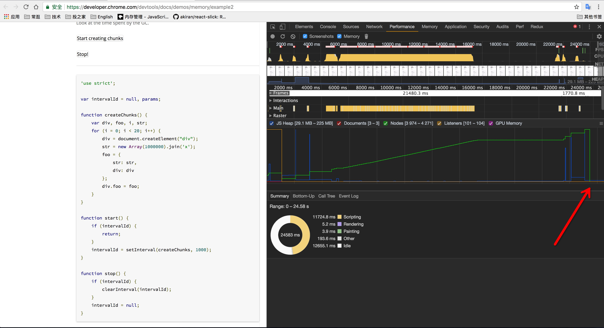

## 简介

  本篇文章讲解JavaScript 中垃圾回收机制，内存泄漏，结合一些常遇到的例子，相信各位看完后，会对JS 中垃圾回收机制有个深入的了解。

## 内存生命周期

  首先，不管什么程序语言，内存生命周期基本是一致的：   

  - 分配你所需要的内存
  - 使用分配到的内存（读、写）
  - 不需要时将其释放归还

  在所有语言中第一和第二部分都很清晰。最后一步在低级语言中(C语言等)很清晰，但是在像JavaScript 等高级语言中，这一步是隐藏的、透明的。因为JavaScript 具有**自动垃圾收集机制**（Garbage collected ）。在编写 JS 时，不需要关心内存使用问题，所需内存分配以及无用内存的回收完全实现了自动管理。

## 内存泄漏

  内存泄漏（memory leaks），什么情况下回导致内存泄漏？可以简单理解为有些代码本来要被回收的，但没有被回收，还一直占用着操作系统内存，从而越积越多，最终会导致内存泄漏（可以理解为，内存满了，就溢出了）。 

## 管理内存（Memory Management）

  分配给web浏览器的可用内存数量通常要比分配给桌面应用程序少。这样做的目的主要是处于安全方面考虑，目的是防止运行JS 的网页耗尽全部系统内存而导致系统崩溃。内存限制问题不仅会影响给变量分配内存，同时还会影响调用栈以及在一个线程中能够同时执行的语句数量。
  
  因此，确保占用最少的内存可以让页面获得更好的性能。而优化内存占用的最佳方式，就是为执行中的代码只保存必要的数据。一旦数据不再有用，最好通过将其值设置为 null 来释放其引用。这个方法叫做**解除引用**。这一做法适用于大多数的全局变量和全局对象的属性。局部变量会在他们离开执行环境时自动被解除引用。

  解除一个值的引用并不意味着自动回收改值所占用的内存。解除引用的真正作用是让值脱离执行环境，以便垃圾收集器下次运行时将其回收。

## 标记清除（Mark and Sweep）

  通常，**垃圾收集器（garbage collector）**在运行时候会给储存在内存中的所有变量都加上**标记**。然后，它会去掉环境中的变量以及被环境中的变量引用的变量的标记。而在此之后再被加上标记的变量将被视为准备删除的变量，原因是环境中的变量已经无法访问到这些变量了。最后，垃圾收集器完成内存清除的工作。

  那标记清除具体是如何呢？有以下几种算法：

 - 在JavaScript 中，全局变量（Global）和window 对象会一直存在，不会被垃圾收集器回收；
 - 递归所用到的所有（包括变量和方法），都不会被回收；
 - 所有没有被标记为“活跃（active）”的，都会被认为是垃圾，收集器释放会回收垃圾，并把内存还给操作系统。
  
## 例子：
### 例一：    

    var n = 123; 
    // 给数值变量分配内存

    var s = "azerty"; 
    // 给字符串分配内存

    // 给对象及其包含的值分配内存
    var o = {
      a: 1,
      b: null
    };

    // 给函数（可调用的对象）分配内存
    function f(a){
      return a + 2;
    }

### 例二：

    function foo(arg) {
      // 此处bar 是全局变量，window.bar 可以访问，所以也不会被回收
      bar = "this is a hidden global variable";
    } 

    function foo() {
      // 此处this 代表 window
      this.variable = "potential accidental global";
    } 

### 例三：

    var someResource = getData();
    setInterval(function() {
      var node = document.getElementById('Node');
      if(node) {
        node.innerHTML = JSON.stringify(someResource));
      }
    }, 1000);

    // 上面这段代码，定时器setInterval 和 someResource 一直存在，不会被回收。可以改成下面代码

    var element = document.getElementById('button');

    function onClick(event) {
        element.innerHtml = 'text';
    }

    element.addEventListener('click', onClick);
    // 手动移除事件监听器和变量
    element.removeEventListener('click', onClick);
    element.parentNode.removeChild(element);

### 例四：

    var intervalId = null, params;

    function createChunks() {
      var div, foo, i, str;
      for (i = 0; i < 20; i++) {
        div = document.createElement("div");
        str = new Array(1000000).join('x');
          foo = {
            str: str,
            div: div
          };
          div.foo = foo;
      }
    }

    function start() {
      if (intervalId) {
        return;
      }
      intervalId = setInterval(createChunks, 1000);
    }

    function stop() {
      if (intervalId) {
        // 清除定时器
        clearInterval(intervalId);
      }
      // 清除变量
      intervalId = null;
    }

 [链接观察垃圾回收是怎么工作的—Google: Watching the GC work](https://developer.chrome.com/devtools/docs/demos/memory/example2)

 

在上面图片中，可以观察到，点击 start 按钮，内存和节点数暴增，当点击stop 时，垃圾收集器回收了这些定时器、变量等，从而释放了内存。

参考：
  - 《JavaScript 高级程序设计第三版》
  - [Memory Management from mozilla](https://developer.mozilla.org/zh-CN/docs/Web/JavaScript/Memory_Management)
  - [4 Types of Memory Leaks in JavaScript and How to Get Rid Of Them](https://auth0.com/blog/four-types-of-leaks-in-your-javascript-code-and-how-to-get-rid-of-them/)
